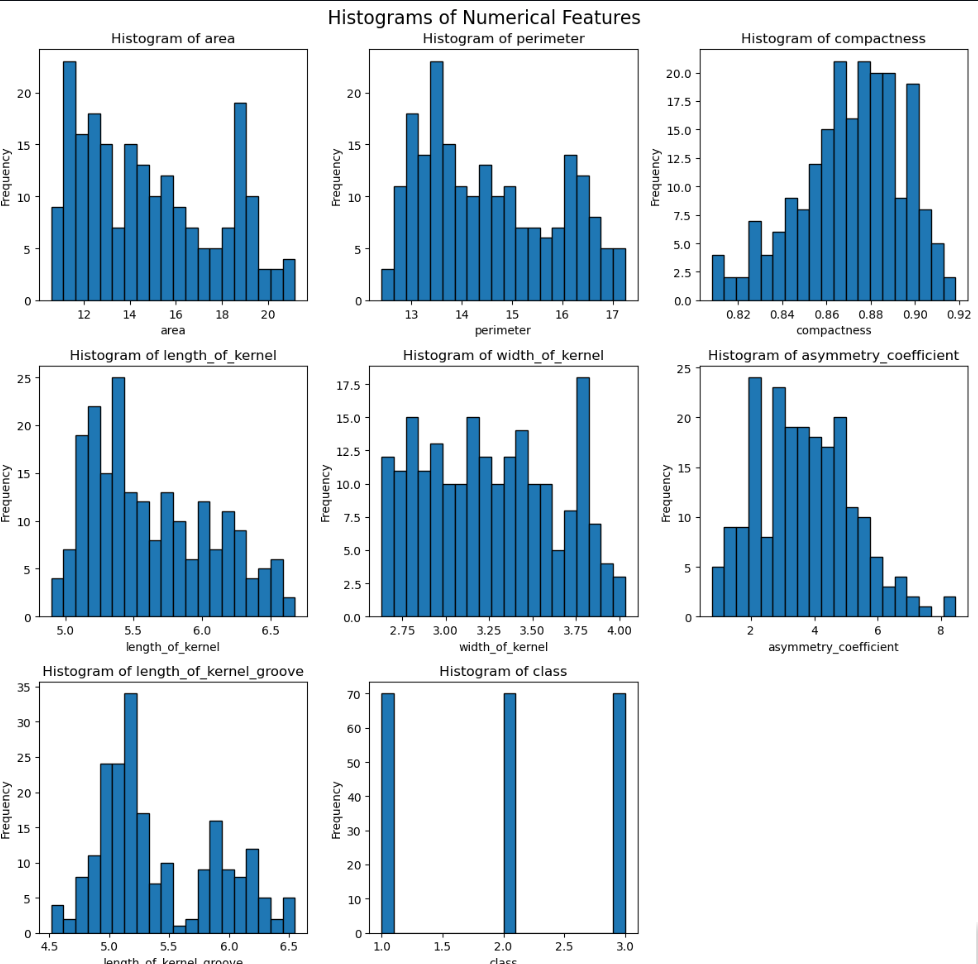

# Applied Statistics and Probabilities using SciPy in Python 📊

Welcome to the **Applied Statistics and Probabilities** repository! This project serves as a practical guide to understanding and applying statistical concepts and probability distributions using Python, specifically leveraging the power of the `SciPy`, `NumPy`, `Pandas`, and `Matplotlib`/`Seaborn` libraries.

## 📝 Overview

In this project, we explore real-world data to perform statistical analysis, visualize distributions, and calculate probabilities. The core analysis is conducted inside a Jupyter Notebook, providing a step-by-step approach to applied statistics.

### Visualizing Data Distributions
Visualizations play a crucial role in understanding statistical data. Below is a snapshot of the histograms generated during the analysis:



## 📂 Repository Contents

* **`course_statistics.ipynb`**: The main Jupyter Notebook containing all the Python code, statistical formulas, computations, and visualizations. 
* **`seeds.csv`**: The dataset used for our statistical analysis. It contains various continuous features that are perfect for exploring distributions, variance, and standard deviations.
* **`histograms.png`**: The exported image showcasing the data distribution plots generated by the code.

## 🧠 Key Concepts Covered

This notebook walks you through several fundamental statistical concepts:
* **Descriptive Statistics:** Mean, Median, Mode, Variance, and Standard Deviation.
* **Probability Distributions:** Normal distribution, uniform distribution, and understanding the probability density function (PDF).
* **Data Visualization:** Creating histograms, KDE (Kernel Density Estimate) plots, and boxplots to understand data spread and outliers.
* **SciPy Statistical Functions:** Using `scipy.stats` for advanced mathematical computations and hypothesis testing (if applicable).

## 🛠️ Requirements & Setup

To run the notebook locally, you will need Python installed along with the following libraries:

```bash
pip install numpy pandas scipy matplotlib seaborn jupyter
```

### How to run:

Clone the repository to your local machine:

```bash
git clone https://github.com/marius2347/Applied-Statistics-and-Probabilities-using-SciPy-in-Python.git
```

Navigate to the project directory:

```bash
cd Applied-Statistics-and-Probabilities-using-SciPy-in-Python
```

Start Jupyter Notebook:

```bash
jupyter notebook
```

Open `course_statistics.ipynb` and run the cells!

### 🤝 Contributing
Feel free to fork this repository, explore the data further, and submit pull requests if you have any improvements or new statistical models to add!

### 📬 Contact
If you have any questions, suggestions, or just want to connect, feel free to reach out:

**Email:** mariusc0023@gmail.com
